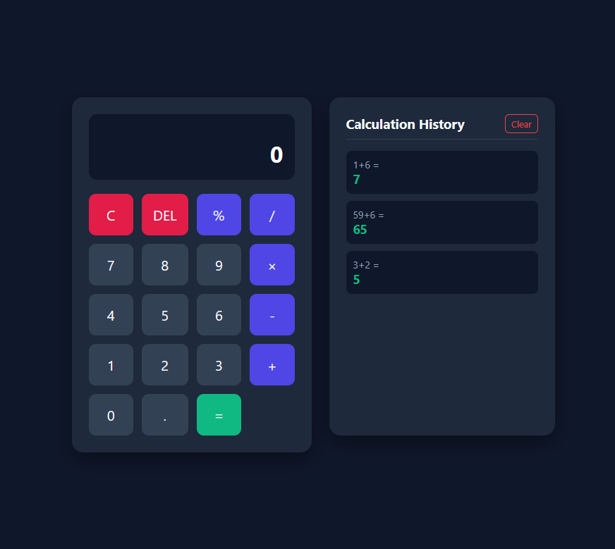

# Docker_FastAPI_Vue_Calculator

## Structure
    calculator-app/
    ├── docker-compose.yml
    ├── backend/
    │   ├── Dockerfile
    │   ├── requirements.txt
    │   └── app.py
    └── frontend/
        ├── Dockerfile
        ├── index.html
        ├── style.css
        └── app.js

# How to Run
    Open terminal and run

    docker compose up --build

    # Open browser

    Open your browser:
        Frontend UI: http://localhost:3000
        Backend API: http://localhost:5000/api/history
        MongoDB: Available on localhost:27017

# Features
    Persistent Calculations: History survives container restarts via named Docker volumes.